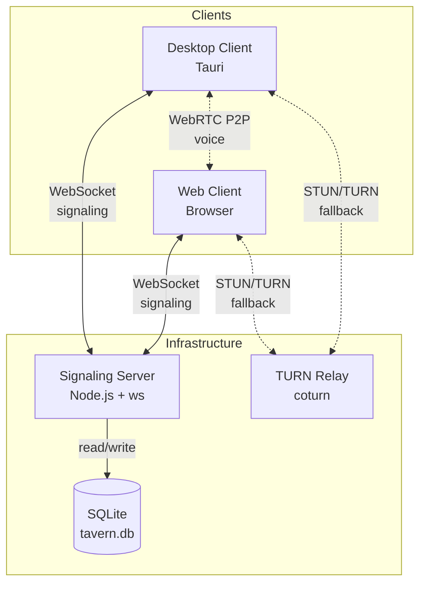
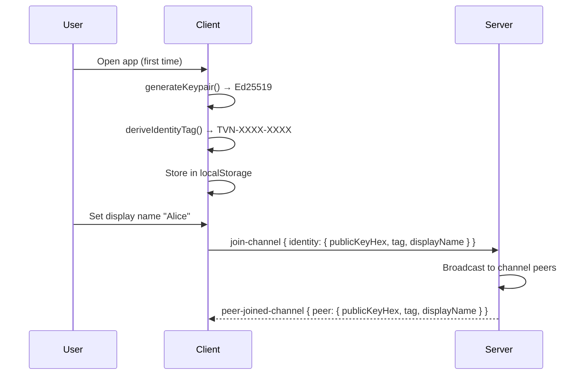
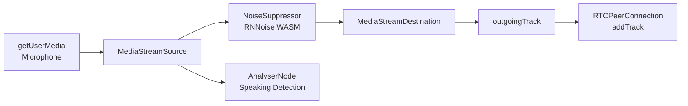
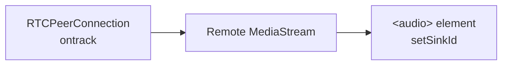

# Tavern Architecture

How the pieces fit together — for contributors and self-hosters.

---

## System Overview



**Key points:**

- Clients connect to the signaling server over **WebSocket** to coordinate peer discovery, Tavern state, and WebRTC handshakes.
- Voice traffic flows **peer-to-peer** via WebRTC. The server never handles audio.
- When direct P2P fails (symmetric NAT, corporate firewalls), traffic is relayed through **coturn** (TURN).
- Tavern and Channel metadata is persisted to **SQLite** so state survives restarts.

---

## Signaling Protocol

All messages are JSON over WebSocket. Messages are either **client → server** or **server → client**.

### Client → Server

| Message Type | Purpose | Key Fields |
|---|---|---|
| `join` | Join a legacy room | `room`, `identity?` |
| `create-tavern` | Create a new Tavern | `name`, `icon?` |
| `create-channel` | Add a channel to a Tavern | `tavernId`, `name` |
| `join-channel` | Enter a voice channel | `tavernId`, `channelId`, `identity` |
| `leave-channel` | Leave a voice channel | `tavernId`, `channelId` |
| `get-tavern-info` | Request Tavern state | `tavernId` |
| `update-identity` | Update display name / public key | `identity` |
| `offer` | WebRTC SDP offer | `sdp`, `target?`, `tavernId?`, `channelId?` |
| `answer` | WebRTC SDP answer | `sdp`, `target`, `tavernId?`, `channelId?` |
| `ice-candidate` | ICE candidate relay | `candidate`, `target`, `tavernId?`, `channelId?` |

### Server → Client

| Message Type | Purpose | Key Fields |
|---|---|---|
| `peer-joined` | A peer joined your room | `peerId`, `identity?` |
| `peer-left` | A peer left your room | `peerId`, `identity?` |
| `peer-list` | List of all peers in room | `peers[]` |
| `peer-identity-updated` | A peer changed their identity | `peerId`, `identity` |
| `tavern-created` | Tavern creation confirmed | `tavern` |
| `channel-created` | Channel creation confirmed | `tavernId`, `channel` |
| `channel-joined` | You joined a channel | `tavernId`, `channelId`, `peers[]` |
| `peer-joined-channel` | A peer entered your channel | `tavernId`, `channelId`, `peer` |
| `peer-left-channel` | A peer left your channel | `tavernId`, `channelId`, `publicKeyHex` |
| `tavern-info` | Tavern state response | `tavern` |
| `offer` / `answer` / `ice-candidate` | Relayed signaling | `from`, `sdp?`, `candidate?`, `identity?` |
| `error` | Error response | `message` |

### Message Validation

Every incoming message is parsed through type-specific validators in `types.ts`. Invalid messages are silently dropped. Validators check:

- Required fields are present and non-empty strings
- Optional fields, if present, are the correct type
- Identity objects have valid `publicKeyHex`, `tag`, and `displayName` fields

---

## Identity System

Tavern uses **Ed25519 keypairs** for zero-signup identity.

### How It Works

1. **First launch:** The client generates an Ed25519 keypair via the Web Crypto API (`crypto.subtle.generateKey`).
2. **Storage:** The keypair is persisted in `localStorage` as hex-encoded strings (raw public key + PKCS#8 private key).
3. **Identity tag:** The first 8 hex characters of the public key are formatted as `TVN-XXXX-XXXX` (e.g., `TVN-a1b2-c3d4`).
4. **Display name:** Users can optionally set a display name. Both `tag` and `displayName` are sent to the signaling server.
5. **Verification:** Any peer can verify a user's identity by comparing the `TVN-XXXX-XXXX` tag. The full public key is exchanged during signaling.

### Key Components

| Component | Package | File |
|---|---|---|
| Keypair generation / export / import | `crypto` | `keypair.ts` |
| Identity tag derivation | `crypto` | `identity.ts` |
| Display name formatting | `crypto` | `identity.ts` |
| Recovery (mnemonic export) | `crypto` | `recovery.ts` |

### Identity Flow



---

## Audio Pipeline

### Outbound (Microphone → Peers)



1. **Capture:** `navigator.mediaDevices.getUserMedia({ audio: true })` acquires the microphone stream.
2. **Noise Suppression:** The audio is routed through an `AudioWorkletNode` running **RNNoise** (WASM). On mobile devices, noise suppression is auto-disabled for performance.
3. **Speaking Detection:** A parallel `AnalyserNode` monitors frequency bins to detect speaking state (threshold: `0.06` normalized level).
4. **Output:** The denoised stream is packaged as a `MediaStreamTrack` and added to each `RTCPeerConnection`.

### Inbound (Peers → Speakers)



1. **Receive:** Each `RTCPeerConnection.ontrack` event delivers a remote `MediaStream`.
2. **Playback:** The stream is attached to an `<audio>` HTML element. Output device can be changed via `setSinkId()`.
3. **Volume:** Per-peer volume control is applied via `GainNode` where supported.

### RNNoise Pipeline Detail

| Mode | Path | Latency | Browser Support |
|---|---|---|---|
| **AudioWorklet** (primary) | Worklet thread, zero main-thread blocking | ~20ms | Chrome, Edge, Firefox 76+ |
| **ScriptProcessor** (fallback) | Main thread, higher latency | ~40ms | All browsers |

The RNNoise WASM module (`@shiguredo/rnnoise-wasm`) operates at a fixed 48 kHz sample rate. Audio is resampled if the `AudioContext` runs at a different rate. VAD (Voice Activity Detection) probability is extracted from each RNNoise frame.

### Opus Configuration

WebRTC encodes audio with **Opus**. Tavern applies custom SDP modifications for optimal voice quality:

- Max average bitrate: **64 kbps**
- Stereo and spatialaudio disabled (mono voice)
- DTX (Discontinuous Transmission) enabled to save bandwidth during silence
- FEC (Forward Error Correction) enabled for lossy networks

---

## Persistence

### TavernStore Interface

All Tavern/Channel state flows through the `TavernStore` abstraction:

```
TavernStore (interface)
├── MemoryStore    — in-memory Maps, no persistence (testing / ephemeral)
└── SqliteStore    — better-sqlite3, WAL mode, foreign keys
```

The server reads `TAVERN_STORE` env var to select the backend:

| Value | Backend | Persistence | Use Case |
|---|---|---|---|
| `memory` | `MemoryStore` | None — data lost on restart | Development, testing |
| `sqlite` | `SqliteStore` | SQLite file on disk | Production, self-hosting |

### Resilience Roadmap

| Layer | Strategy | Status |
|---|---|---|
| **Layer 1** | SQLite on single node | **Implemented** (current) |
| **Layer 2** | Multi-node replication (Litestream / Raft) | Planned (Phase 2) |
| **Layer 3** | DHT-based distributed records | Planned (Phase 2+) |

### Schema

```sql
CREATE TABLE taverns (
  id                TEXT PRIMARY KEY,
  name              TEXT NOT NULL,
  icon              TEXT DEFAULT '',
  creator_public_key TEXT NOT NULL,
  signaling_url     TEXT DEFAULT '',
  created_at        TEXT NOT NULL DEFAULT (datetime('now'))
);

CREATE TABLE channels (
  id         TEXT PRIMARY KEY,
  tavern_id  TEXT NOT NULL REFERENCES taverns(id) ON DELETE CASCADE,
  name       TEXT NOT NULL,
  created_at TEXT NOT NULL DEFAULT (datetime('now'))
);
```

Peer presence (who is currently in a channel) is **not** persisted — it's ephemeral runtime state managed in memory by `TavernRooms`.

---

## Theming

Tavern supports runtime theme switching via CSS custom properties.

### Built-in Themes

| Theme | File | Description |
|---|---|---|
| Dark | `themes/dark.css` | Default dark theme |
| Light | `themes/light.css` | Light variant |
| Retro | `themes/retro.css` | Pixel-art / retro aesthetic |

### How It Works

1. Each theme file defines CSS custom properties (`--bg-primary`, `--text-color`, `--accent`, etc.).
2. The `ThemeManager` class loads and applies themes by injecting a `<style>` element.
3. Theme preference is saved to `localStorage` and restored on launch.
4. Custom themes can be created by providing a CSS file that defines the same custom properties.

---

## Monorepo Structure

```
tavern/
├── packages/
│   ├── signaling-server/    # Node.js WebSocket signaling + TavernStore
│   │   └── src/
│   │       ├── index.ts         # HTTP server, WebSocket upgrade, message routing
│   │       ├── rooms.ts         # TavernRooms — runtime state + store write-through
│   │       ├── room-manager.ts  # Legacy room manager (simple peer tracking)
│   │       ├── types.ts         # All message types + validators
│   │       ├── store.ts         # TavernStore interface + record types
│   │       ├── memory-store.ts  # In-memory TavernStore implementation
│   │       └── sqlite-store.ts  # SQLite TavernStore implementation
│   │
│   ├── voice-engine/        # WebRTC + Opus + RNNoise audio engine
│   │   └── src/
│   │       ├── index.ts              # App entry point, UI wiring
│   │       ├── audio.ts             # Mic capture, mute, speaking detection
│   │       ├── mesh.ts              # WebRTC mesh manager (P2P topology)
│   │       ├── peer-manager.ts      # Individual RTCPeerConnection lifecycle
│   │       ├── noise-suppression.ts # RNNoise WASM integration
│   │       ├── opus-config.ts       # SDP Opus parameter tuning
│   │       ├── speaking.ts          # Speaking indicator state
│   │       ├── vad.ts               # Voice Activity Detection
│   │       ├── ptt.ts               # Push-to-talk handler
│   │       ├── settings-store.ts    # Settings persistence (localStorage)
│   │       ├── tavern-client.ts     # Saved tavern list management
│   │       ├── desktop-bridge.ts    # Tauri ↔ web bridge
│   │       └── ui/                  # UI components (settings, themes, devices)
│   │
│   ├── crypto/              # Identity + encryption primitives
│   │   └── src/
│   │       ├── keypair.ts       # Ed25519 keypair generate / export / import
│   │       ├── identity.ts      # TVN-XXXX-XXXX tag derivation
│   │       ├── recovery.ts      # Mnemonic backup / restore
│   │       └── display-name.ts  # Display name utilities
│   │
│   ├── client-desktop/      # Tauri desktop app shell
│   │   └── src-tauri/
│   │       ├── src/
│   │       │   ├── lib.rs       # Tauri plugin setup
│   │       │   ├── commands.rs  # IPC commands
│   │       │   ├── shortcuts.rs # Global keyboard shortcuts
│   │       │   └── tray.rs      # System tray
│   │       └── tauri.conf.json  # Tauri configuration
│   │
│   └── shared/              # Shared types and utilities
│       └── src/
│           ├── types.ts         # Cross-package type definitions
│           └── ice-config.ts    # ICE/STUN/TURN server configuration
│
├── docker/
│   ├── Dockerfile.signaling     # Multi-stage Docker build
│   └── docker-compose.yml       # Signaling + coturn stack
│
└── docs/
    ├── self-hosting.md          # Self-hosting guide
    └── architecture.md          # This file
```
